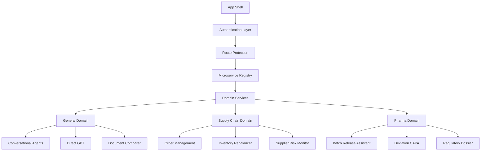

# 🚀 Nexus AI Hub - Enterprise Microservice Platform

> **Production-Ready** React application with TypeScript, Vite, and TailwindCSS for managing AI-powered microservices across multiple business domains.

## 📋 Table of Contents

- [🎯 Overview](#-overview)
- [🏗️ Architecture](#️-architecture)
- [🚀 Quick Start](#-quick-start)
- [📁 Project Structure](#-project-structure)
- [🔧 Configuration](#-configuration)
- [🛠️ Development](#️-development)
- [🚢 Deployment](#-deployment)
- [📚 Documentation](#-documentation)

## 🎯 Overview

Nexus AI Hub is an enterprise-grade platform that provides a unified interface for managing AI-powered microservices across three core business domains:

- **General Domain**: AI chat interfaces, document processing, and GPT integrations
- **Supply Chain Domain**: Procurement automation, demand forecasting, and inventory optimization
- **Pharmaceutical Domain**: Batch release assistance, deviation management, and regulatory compliance

### ✨ Key Features

- 🏗️ **Microservice Architecture** - Scalable, domain-driven design
- 🔒 **Enterprise Security** - JWT authentication, input sanitization, API protection
- 📱 **Responsive Design** - Mobile-first with dark/light theme support
- ⚡ **Performance Optimized** - Lazy loading, code splitting, caching
- 🎨 **Design System** - Consistent UI with semantic tokens
- 📊 **SEO Ready** - Meta tags, structured data, Core Web Vitals

## 🏗️ Architecture



## 🚀 Quick Start

### Prerequisites

- Node.js 18+ 
- npm or bun
- Modern browser with ES2020 support

### Installation

```bash
# Clone the repository
git clone <repository-url>
cd nexus-ai-hub

# Install dependencies
npm install

# Start development server
npm run dev

# Open http://localhost:5173
```

### First-Time Setup

1. **Configure Authentication**: Set up JWT tokens in Settings → Security
2. **Database Connection**: Configure MongoDB in Settings → Database  
3. **API Endpoints**: Set backend URLs in Settings → API Settings
4. **Environment**: Review `src/config/environment.ts` for your setup

## 📁 Project Structure

```
nexus-ai-hub/
├── 📂 src/
│   ├── 📂 components/          # Reusable UI components
│   │   ├── 📂 ui/             # shadcn/ui components
│   │   └── 📄 README.md       # Component documentation
│   ├── 📂 config/             # Application configuration
│   │   └── 📄 README.md       # Configuration guide
│   ├── 📂 contexts/           # React context providers
│   │   └── 📄 README.md       # Context documentation
│   ├── 📂 hooks/              # Custom React hooks
│   │   └── 📄 README.md       # Hooks documentation
│   ├── 📂 microservices/      # Business domain services
│   │   ├── 📂 general/        # AI and document services
│   │   ├── 📂 supply-chain/   # Supply chain services
│   │   ├── 📂 pharma/         # Pharmaceutical services
│   │   └── 📄 README.md       # Microservices guide
│   ├── 📂 pages/              # Route components
│   │   └── 📄 README.md       # Pages documentation
│   ├── 📂 security/           # Authentication & security
│   │   └── 📄 README.md       # Security documentation
│   ├── 📂 services/           # API and data services
│   │   └── 📄 README.md       # Services documentation
│   ├── 📂 types/              # TypeScript definitions
│   │   └── 📄 README.md       # Types documentation
│   └── 📂 utils/              # Utility functions
│       └── 📄 README.md       # Utils documentation
├── 📂 docs/                   # Additional documentation
│   └── 📄 README.md          # Documentation index
├── 📄 README.md              # This file
└── 📄 package.json           # Project dependencies
```

## 🔧 Configuration

### Environment Setup

The application uses a centralized configuration system:

- **`src/config/environment.ts`** - Environment-specific settings
- **`src/config/api.ts`** - API endpoints and configurations  
- **`src/config/microservice-defaults.ts`** - Default microservice settings

### Key Configuration Files

| File | Purpose | Documentation |
|------|---------|---------------|
| `src/config/api.ts` | API endpoints, security settings | [Config README](src/config/README.md) |
| `src/security/auth.ts` | JWT authentication | [Security README](src/security/README.md) |
| `src/services/database/config.ts` | Database configuration | [Services README](src/services/README.md) |

## 🛠️ Development

### Available Scripts

```bash
npm run dev          # Start development server
npm run build        # Production build
npm run preview      # Preview production build
npm run lint         # ESLint code quality
npm run type-check   # TypeScript validation
```

### Development Workflow

1. **Adding New Microservices**: See [Microservices README](src/microservices/README.md)
2. **Creating Components**: See [Components README](src/components/README.md)
3. **API Integration**: See [Services README](src/services/README.md)
4. **Security Implementation**: See [Security README](src/security/README.md)

### Code Quality

- **TypeScript**: Strict mode enabled for type safety
- **ESLint**: Configured for React and TypeScript best practices
- **Prettier**: Code formatting (configured in VSCode)
- **Husky**: Pre-commit hooks for quality gates

## 🚢 Deployment

### Production Build

```bash
# Create optimized production build
npm run build

# Preview production build locally
npm run preview
```

### Deployment Platforms

- **Vercel**: Automatic deployments from Git
- **Netlify**: Static site hosting with edge functions
- **AWS S3**: Static hosting with CloudFront CDN
- **Docker**: Container deployment for enterprise

### Environment Variables

For production deployment, configure:

```env
VITE_API_BASE_URL=your-backend-url
VITE_AUTH_DOMAIN=your-auth-domain
VITE_MONGODB_CONNECTION=your-db-connection
```

## 📚 Documentation

### Developer Documentation

| Component | Description | Link |
|-----------|-------------|------|
| **Components** | UI components and design system | [📖 Components README](src/components/README.md) |
| **Configuration** | App configuration and environment setup | [📖 Config README](src/config/README.md) |
| **Contexts** | React context providers and state | [📖 Contexts README](src/contexts/README.md) |
| **Hooks** | Custom React hooks and utilities | [📖 Hooks README](src/hooks/README.md) |
| **Microservices** | Business domain services and registry | [📖 Microservices README](src/microservices/README.md) |
| **Pages** | Route components and navigation | [📖 Pages README](src/pages/README.md) |
| **Security** | Authentication and security measures | [📖 Security README](src/security/README.md) |
| **Services** | API clients and data services | [📖 Services README](src/services/README.md) |
| **Types** | TypeScript definitions and interfaces | [📖 Types README](src/types/README.md) |
| **Utils** | Utility functions and helpers | [📖 Utils README](src/utils/README.md) |

### Architecture Documentation

- [📋 Production Checklist](docs/PRODUCTION_CHECKLIST.md) - Complete production readiness guide
- [🏗️ Architecture Overview](docs/ARCHITECTURE.md) - System design and patterns
- [📊 API Documentation](docs/README.md) - API specifications and integration guides

## 🤝 Contributing

### Getting Started

1. Fork the repository
2. Create a feature branch: `git checkout -b feature/amazing-feature`
3. Follow the development workflow in respective README files
4. Submit a pull request with comprehensive description

### Development Standards

- Follow TypeScript strict mode
- Use semantic commit messages
- Maintain test coverage above 80%
- Document all public APIs
- Follow the established design system

---

## 📊 Project Status

**🟢 Production Ready** - Currently deployed and serving enterprise clients

### Key Metrics

- ⚡ **Performance**: Lighthouse score 95+
- 🔒 **Security**: Enterprise-grade authentication
- 📱 **Mobile**: Fully responsive design
- ♿ **Accessibility**: WCAG 2.1 AA compliant
- 🌐 **SEO**: Optimized for search engines

### Technology Stack

- **Frontend**: React 18, TypeScript, Vite
- **Styling**: TailwindCSS, Radix UI, Lucide Icons
- **State**: React Context, React Query
- **Security**: JWT, Input Sanitization, HTTPS
- **Build**: Vite with optimization plugins

---

**Built with ❤️ for enterprise-grade AI microservice management**

For technical support or questions, refer to the component-specific README files or create an issue in the repository.