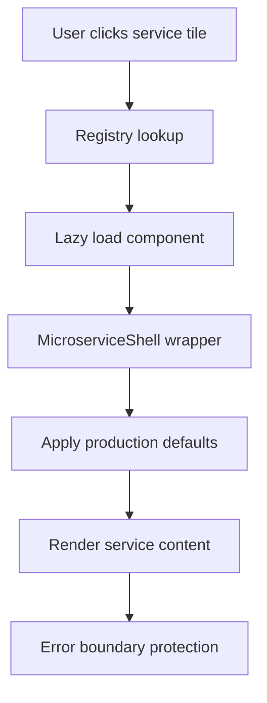

# Architecture Overview

## 🏗️ System Architecture

### Core Design Principles
- **Microservice Architecture**: Each business domain has independent services
- **Production-First**: All components designed for enterprise deployment
- **Developer Experience**: Simple, consistent patterns for adding new services
- **Performance-Optimized**: Lazy loading, code splitting, and efficient bundling

## 📁 Project Structure

```
src/
├── components/
│   ├── MicroserviceShell.tsx      # Layout wrapper with production defaults
│   ├── EmbeddedApp.tsx           # Optimized iframe container
│   ├── MicroserviceContainer.tsx  # Route container with error boundaries
│   └── ui/                       # Reusable UI components
├── config/
│   └── microservice-defaults.ts  # Centralized production configuration
├── microservices/
│   ├── registry.ts               # Single source of truth for all services
│   ├── general/                  # AI and general-purpose services
│   ├── supply-chain/             # Supply chain domain services
│   └── pharma/                   # Pharmaceutical domain services
├── types/
│   └── microservice.ts           # TypeScript interfaces
├── utils/
│   └── security.ts               # Security utilities and helpers
└── services/
    └── api.ts                    # Centralized API client
```

## 🔧 Core Components

### MicroserviceShell
Production-optimized layout wrapper that provides:
- Consistent header, navigation, and spacing
- Automatic SEO metadata injection
- Responsive design with accessibility
- Error boundary integration
- Theme and layout configuration

### Production Defaults System
Centralized configuration ensuring all microservices follow production standards:
- **Full-bleed layout**: Maximum space utilization
- **Minimal padding**: Optimized for embedded applications  
- **Compact headers**: More space for content
- **Responsive behavior**: Mobile-first design patterns

### Registry System
Single source of truth that automatically:
- Generates AppStore tiles
- Creates lazy-loaded routes
- Handles SEO metadata
- Manages service discovery
- Enables/disables services

## 🚀 Request Flow



## 📊 Domain Architecture

### General Domain
**Purpose**: AI and document processing services
- Conversational Agents (AI chat interface)
- Direct GPT (Azure OpenAI playground)
- Document Comparer (AI document analysis)

### Supply Chain Domain  
**Purpose**: Supply chain optimization and management
- RFQ-to-Award Co-Pilot (Procurement automation)
- Demand Forecast Review (ML analytics)
- Supplier Risk Monitor (Risk management)
- Inventory Rebalancer (Optimization)
- Order Management Agent (Operations - Live system)

### Pharma Domain
**Purpose**: Pharmaceutical compliance and quality
- Batch Release Assistant (Quality control)
- Deviation CAPA Summarizer (Quality management)
- Regulatory Dossier Helper (Compliance)

## 🔒 Security Architecture

### Input Sanitization
- XSS protection utilities
- Safe HTML rendering
- Input validation helpers

### API Security
- Centralized API client with interceptors
- Request/response validation
- Error handling and logging

### Authentication
- JWT-based session management
- Route protection guards
- Automatic token refresh

## 📈 Performance Architecture

### Code Splitting Strategy
```
Initial Bundle
├── Core App Shell (~200KB)
├── Shared Components (~150KB)
└── Route-based splits
    ├── General Domain (~50KB each)
    ├── Supply Chain Domain (~60KB each)
    └── Pharma Domain (~45KB each)
```

### Lazy Loading Implementation
- React.lazy() for route-level splitting
- Dynamic imports in registry
- Suspense boundaries with skeleton loaders
- Error boundaries for graceful failures

### Optimization Techniques
- Component memoization (React.memo)
- Debounced search inputs
- Image lazy loading
- Bundle analysis and tree shaking

## 🎨 Design System Integration

### Theme Architecture
- CSS custom properties for colors
- Responsive breakpoint system
- Dark/light mode support
- Component variant system

### Layout System
- Flexible grid system
- Responsive typography scale
- Consistent spacing system
- Accessibility-first design

## 🔄 Development Workflow

### Adding New Microservices
1. **Create component** in appropriate domain folder
2. **Add registry entry** with metadata and configuration
3. **Service automatically appears** in AppStore with routing

### Configuration Override Pattern
```tsx
// Use defaults (recommended)
<MicroserviceShell title="Service" />

// Override specific settings when needed  
<MicroserviceShell 
  title="Service"
  layout={{ padding: 'md' }}  // Override only what's needed
/>
```

### Error Handling Strategy
- Component-level error boundaries
- Global error reporting
- User-friendly error messages
- Recovery mechanisms

## 📊 Monitoring & Observability

### Performance Metrics
- Core Web Vitals tracking
- Bundle size monitoring
- Route-level performance
- User interaction analytics

### Error Tracking
- Component error boundaries
- API error logging
- User session replay
- Performance degradation alerts

## 🚀 Deployment Architecture

### Build Strategy
- Vite for fast development and optimal production builds
- Tree shaking for minimal bundle sizes
- Asset optimization and compression
- Source maps for production debugging

### Production Optimizations
- Static asset caching
- Route-based prefetching
- Service worker for offline capability
- CDN integration for global delivery

---

This architecture supports **enterprise-scale deployment** with **developer-friendly patterns** for rapid microservice development and deployment.