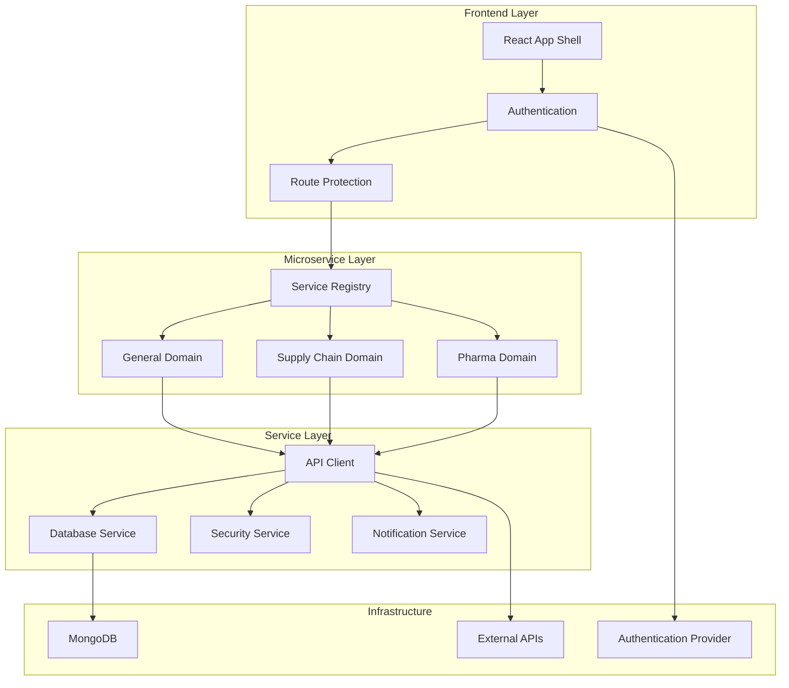
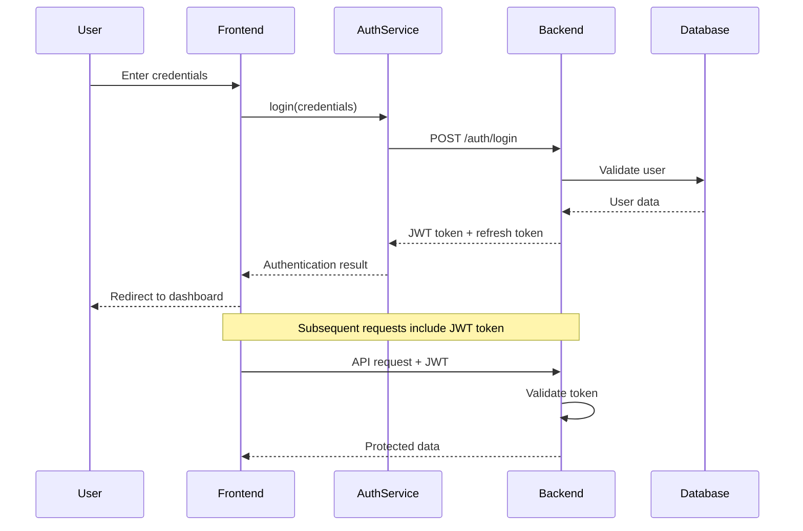
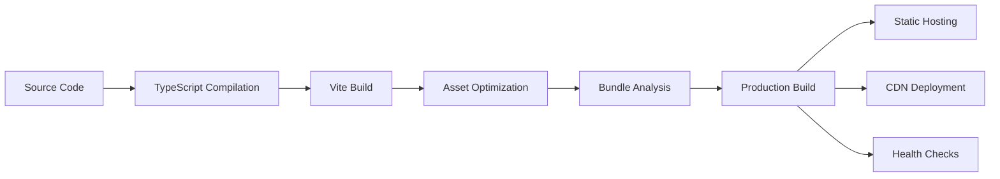

# 📚 Documentation Hub

> Comprehensive documentation for the Nexus AI Hub platform

## 📋 Documentation Index

### 📖 Architecture & Design
- [🏗️ Architecture Overview](ARCHITECTURE.md) - System design and patterns
- [📋 Production Checklist](PRODUCTION_CHECKLIST.md) - Complete production readiness guide
- [🎨 Design System Guide](#design-system) - UI/UX design principles and implementation

### 🛠️ Developer Guides

#### Core Components
- [🧩 Components](../src/components/README.md) - UI components and design system
- [⚙️ Configuration](../src/config/README.md) - Application configuration management
- [🌐 Contexts](../src/contexts/README.md) - React context providers and state
- [🪝 Hooks](../src/hooks/README.md) - Custom React hooks and utilities

#### Services & Architecture
- [🚀 Microservices](../src/microservices/README.md) - Business domain services
- [📄 Pages](../src/pages/README.md) - Route components and navigation
- [🔒 Security](../src/security/README.md) - Authentication and security measures
- [🌐 Services](../src/services/README.md) - API clients and data services

#### Development Utilities
- [📄 Types](../src/types/README.md) - TypeScript definitions and interfaces
- [🔧 Utils](../src/utils/README.md) - Utility functions and helpers

## 🎯 Quick Start Guides

### For New Developers

1. **Getting Started**: Read the main [README](../README.md)
2. **Architecture**: Review [Architecture Overview](ARCHITECTURE.md)
3. **Components**: Explore [Components Guide](../src/components/README.md)
4. **Security**: Understand [Security Implementation](../src/security/README.md)

### For Adding Microservices

1. **Microservice Guide**: [Microservices README](../src/microservices/README.md)
2. **Configuration**: [Config Management](../src/config/README.md)
3. **Types**: [TypeScript Definitions](../src/types/README.md)
4. **Testing**: [Component Testing](../src/components/README.md#testing)

### For Frontend Development

1. **Components**: [Component Library](../src/components/README.md)
2. **Hooks**: [Custom Hooks](../src/hooks/README.md)
3. **State Management**: [Contexts Guide](../src/contexts/README.md)
4. **Utilities**: [Helper Functions](../src/utils/README.md)

## 🏗️ System Architecture

### High-Level Overview



### Component Hierarchy

```
App Shell
├── AuthProvider
├── NotificationProvider
├── ThemeProvider
└── Router
    ├── ProtectedRoute
    │   ├── Home (Dashboard)
    │   ├── AppStore (Service Discovery)
    │   ├── Settings (Configuration)
    │   └── MicroserviceContainer
    │       └── MicroserviceShell
    │           └── Service Components
    └── PublicRoute
        └── Login
```

## 🎨 Design System

### Core Principles

- **Consistency**: Unified design language across all components
- **Accessibility**: WCAG 2.1 AA compliance
- **Responsive**: Mobile-first design approach
- **Themeable**: Support for light/dark modes
- **Semantic**: Use design tokens, not direct values

### Design Tokens

```css
/* Color System */
:root {
  --primary: 222.2 84% 4.9%;
  --secondary: 210 40% 96%;
  --background: 0 0% 100%;
  --foreground: 222.2 84% 4.9%;
  --muted: 210 40% 96%;
  --accent: 210 40% 96%;
  --border: 214.3 31.8% 91.4%;
}

/* Typography Scale */
--font-heading: 'Inter', system-ui, sans-serif;
--font-body: 'Inter', system-ui, sans-serif;
--font-mono: 'JetBrains Mono', monospace;

/* Spacing Scale */
--space-xs: 0.25rem;
--space-sm: 0.5rem;
--space-md: 1rem;
--space-lg: 1.5rem;
--space-xl: 2rem;
```

### Component Patterns

#### Layout Components
- `AppShell` - Main application layout
- `MicroserviceShell` - Service page wrapper
- `PageHeader` - Page-level header component
- `EmbeddedApp` - Iframe container for external services

#### UI Components
- `Button` - Interactive buttons with variants
- `Card` - Content containers
- `Dialog` - Modal dialogs and overlays
- `Form` - Form elements and validation

#### Navigation Components
- `Breadcrumb` - Navigation breadcrumbs
- `Sidebar` - Application sidebar
- `Menu` - Dropdown and context menus

## 🔐 Security Architecture

### Authentication Flow



### Security Layers

1. **Input Sanitization**: XSS protection and input validation
2. **Authentication**: JWT-based with refresh tokens
3. **Authorization**: Role-based access control
4. **Session Management**: Automatic timeout and renewal
5. **API Security**: Request signing and encryption
6. **Rate Limiting**: Prevent abuse and attacks

## 📊 API Architecture

### API Client Architecture

```typescript
// Centralized API client with interceptors
ApiClient
├── Request Interceptors
│   ├── Authentication (JWT)
│   ├── Request Signing
│   └── Rate Limiting
├── Response Interceptors
│   ├── Error Handling
│   ├── Token Refresh
│   └── Data Transformation
└── Configuration
    ├── Base URL
    ├── Timeout Settings
    └── Retry Logic
```

### Service Integration

All services use the centralized API client for consistency:

```typescript
// Service pattern
class ServiceClient {
  constructor(private apiClient: ApiClient) {}
  
  async getData<T>(endpoint: string): Promise<T> {
    return this.apiClient.get<T>(endpoint);
  }
}
```

## 🧪 Testing Strategy

### Testing Pyramid

```
    E2E Tests (Few)
   ╱─────────────────╲
  ╱   Integration     ╲
 ╱      Tests         ╲
╱─────────────────────╲
│    Unit Tests       │ 
│     (Many)          │
└─────────────────────┘
```

### Testing Approach

1. **Unit Tests**: Individual functions and components
2. **Integration Tests**: Component interactions and API calls
3. **E2E Tests**: Full user workflows and critical paths

### Testing Tools

- **Jest**: Unit testing framework
- **React Testing Library**: Component testing
- **MSW**: API mocking for tests
- **Playwright**: End-to-end testing

## 🚀 Deployment Pipeline

### Build Process



### Environments

- **Development**: Local development with hot reload
- **Staging**: Pre-production testing environment
- **Production**: Live application with monitoring

## 📈 Performance Optimization

### Core Web Vitals

- **LCP (Largest Contentful Paint)**: < 2.5s
- **FID (First Input Delay)**: < 100ms
- **CLS (Cumulative Layout Shift)**: < 0.1

### Optimization Techniques

1. **Code Splitting**: Route-based lazy loading
2. **Image Optimization**: WebP format with lazy loading
3. **Caching**: Service worker and CDN caching
4. **Bundle Optimization**: Tree shaking and compression
5. **Critical CSS**: Inline critical styles

## 📚 Additional Resources

### External Documentation
- [React Documentation](https://react.dev/) - React framework
- [TypeScript Handbook](https://www.typescriptlang.org/docs/) - TypeScript guide
- [Tailwind CSS](https://tailwindcss.com/docs) - Utility-first CSS
- [Radix UI](https://www.radix-ui.com/) - Accessible UI primitives

### Development Tools
- [ESLint Configuration](../eslint.config.js) - Code linting rules
- [TypeScript Config](../tsconfig.json) - TypeScript compilation settings
- [Vite Configuration](../vite.config.ts) - Build tool settings
- [Tailwind Config](../tailwind.config.ts) - Styling configuration

### Deployment Resources
- [Vercel Deployment Guide](https://vercel.com/docs)
- [Netlify Documentation](https://docs.netlify.com/)
- [AWS Amplify Guide](https://docs.amplify.aws/)

---

## 🤝 Contributing

### Documentation Guidelines

1. **Structure**: Follow the established README format
2. **Examples**: Include practical code examples
3. **Linking**: Cross-reference related documentation
4. **Updates**: Keep documentation synchronized with code changes

### Adding New Documentation

1. Create README in appropriate directory
2. Follow the template and structure conventions
3. Update this index with links
4. Test all code examples

---

**Last Updated**: August 2024
**Status**: ✅ Production Ready

For questions about documentation or suggestions for improvements, please create an issue in the repository.